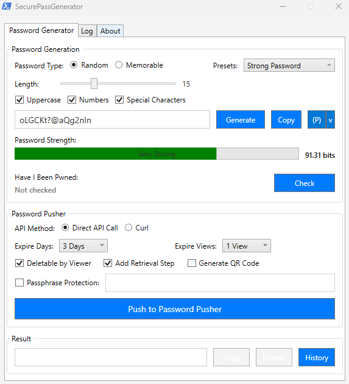
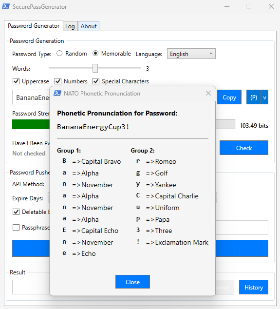
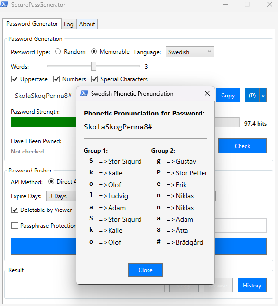
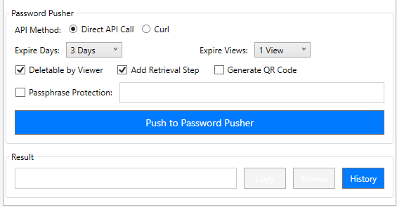

# SecurePassGenerator

A comprehensive PowerShell password generation and secure sharing tool with modern WPF GUI.


[](https://www.buymeacoffee.com/onlyalex1984)

## Overview

SecurePassGenerator is a powerful tool designed to create, analyze, and securely share passwords. With its intuitive WPF interface, it offers both random and memorable password generation along with security analysis and secure sharing capabilities.

### Main Interface:



## Key Features

- 🔐 **Versatile Password Generator**

  - Random or memorable password generation
  - Customizable length, complexity, and character sets
  - Multiple language support for memorable passwords (English/Swedish)
  - Predefined password presets for different security levels
  - Custom password preset management:
    - Save and load custom password presets
    - Create, edit, and delete user-defined presets
    - Enable/disable presets to customize dropdown options
    - Set default preset for application startup
    - Automatic backup of presets file when saving changes

- 🔤 **Phonetic Pronunciation**

  - NATO phonetic alphabet support
  - Swedish military phonetic alphabet support
  - Character-by-character pronunciation for easy communication

- 📊 **Security Analysis**

  - Password strength assessment with entropy calculation
  - Integration with Have I Been Pwned API for breach checking
  - Colored strength indicators
  - Service availability detection and graceful handling

- 🔄 **Secure Password Sharing**
  - Integration with [Password Pusher](https://pwpush.com) for secure sharing
  - Customizable expiration settings (time/views)
  - QR code generation for easy mobile access
  - Password links history tracking
  - Multiple API methods (Direct and Curl) for improved reliability

## Requirements

- PowerShell 5.1 or higher
- Windows with .NET Framework (included with Windows)

## Password Presets

SecurePassGenerator includes a comprehensive preset management system that allows you to:

- Create custom presets with your preferred password settings
- Edit existing presets to adjust their parameters
- Enable or disable presets to customize the dropdown options
- Set a default preset that will be automatically selected at startup
- Automatic backup of your presets file when making changes

The application comes with several built-in presets:

- Medium Password (10 characters)
- Strong Password (15 characters)
- Very Strong Password (20 characters)
- NIST Compliant (12 characters)
- SOC 2 Compliant (14 characters)
- Financial Compliant (16 characters)

## Updates and Maintenance

SecurePassGenerator includes an integrated update system that provides:

- Check for updates directly from within the application
- Support for both stable and pre-release versions
- Smart installer location detection with fallback options
- Seamless update process with minimal user interaction
- Preservation of custom presets during updates

## Installation

There are three ways to install and use SecurePassGenerator:

### Method 1: Using the Interactive Installer (Recommended)

The easiest way to get started with SecurePassGenerator:

1. Download and extract the ZIP file from the [releases page](https://github.com/onlyalex1984/securepassgenerator-powershell/releases)
2. Locate `RUN_ME_FIRST.bat` in the extracted folder
3. Right-click the file and select "Properties"
4. At the bottom of the Properties window, check the "Unblock" box and click OK
5. Double-click `RUN_ME_FIRST.bat` to run the installer
6. Follow the interactive menu to choose between offline or online installation
7. A desktop shortcut will be created automatically

The installer offers two options:

- **Offline Installation**: Uses the included files (no internet required)
- **Online Installation**: Downloads the latest version from GitHub

For more details, see the [Installer README](tools/installer/README.md).

### Method 2: Direct Execution

For users who prefer to run the script directly:

1. Download and extract the ZIP file from the [releases page](https://github.com/onlyalex1984/securepassgenerator-powershell/releases)
2. Locate `SecurePassGenerator.ps1` in the extracted folder
3. Right-click the file and select "Properties"
4. At the bottom of the Properties window, check the "Unblock" box and click OK
5. Open PowerShell or Command Prompt
6. Navigate to the folder where you extracted the files
7. Run the script with execution policy bypass:
   ```powershell
   powershell.exe -ExecutionPolicy Bypass -File ".\SecurePassGenerator.ps1"
   ```

This method runs the script directly without modifying any system settings and without creating a desktop shortcut.

### Method 3: From Repository Source

For developers or those who want the latest code:

1. Clone the repository or download the source code from GitHub:
   ```
   git clone https://github.com/onlyalex1984/securepassgenerator-powershell.git
   ```
   Or use the "Download ZIP" option from the GitHub repository page and extract it
2. Navigate to the repository folder
3. Right-click the `SecurePassGenerator.ps1` file and select "Properties"
4. At the bottom of the Properties window, check the "Unblock" box and click OK (Windows often blocks downloaded files for security)
5. Run the script with execution policy bypass:
   ```powershell
   powershell.exe -ExecutionPolicy Bypass -File ".\SecurePassGenerator.ps1"
   ```

Alternatively, you can use the installer in the `tools/installer/` directory:

1. Navigate to `tools/installer/` in the repository
2. Locate `RUN_ME_FIRST.bat`
3. Right-click the file and select "Properties"
4. At the bottom of the Properties window, check the "Unblock" box and click OK (Windows often blocks downloaded files for security)
5. Run the installer by double-clicking it
6. Follow the interactive menu to choose between offline or online installation
7. A desktop shortcut will be created automatically

## Quick Start Guide

### Generate a Random Password

1. Launch the application
2. Select "Random" password type
3. Choose desired length and character options
4. Click "Generate"
5. Click "Check" button to verify the password hasn't appeared in data breaches
6. Copy the password or share it securely

### Create a Memorable Password

1. Launch the application
2. Select "Memorable" password type
3. Choose language (English or Swedish)
4. Select number of words
5. Click "Generate"
6. Check password strength and copy as needed

### Share a Password Securely

1. Generate a password
2. Click "Check" button to verify the password hasn't appeared in data breaches
3. Set expiration options (days/views)
4. Optionally add passphrase protection
5. Click "Push to Password Pusher"
6. Copy and share the generated URL

### Use Phonetic Pronunciation

1. Generate a password
2. Click the "(P)" button or use the dropdown menu
3. Select NATO or Swedish phonetic alphabet
4. View the character-by-character pronunciation
5. Use this to verbally communicate passwords accurately

## Detailed Features

### Password Generation

SecurePassGenerator provides two ways to generate passwords:

#### Random Passwords

- Choose length (8-32 characters)
- Select character types (uppercase, lowercase, numbers, special characters)
- Apply presets (Medium, Strong, Very Strong, NIST Compliant, SOC 2 Compliant, Financial Compliant)
- Create and manage custom presets:
  - Save current settings as a new preset
  - Edit existing custom presets
  - Enable/disable presets to customize dropdown options
  - Set a default preset for application startup

#### Memorable Passwords

- Select word count (1-5 words)
- Choose language (English or Swedish)
- Add numbers and special characters for extra security

### Memorable Password Generation:

#### English Words:


#### Swedish Words:


### Password Security

- **Strength Assessment**: Visual indicator shows password strength
- **Entropy Calculation**: Displays entropy value in bits
- **Breach Checking**: Checks if password has appeared in known data breaches via Have I Been Pwned

  ### Checking a Password:

  

  ### Password Not Found in Breaches:

  

  ### Password Found in Breaches:

  

- **Phonetic Pronunciation**: Use NATO or Swedish phonetic alphabets to easily communicate passwords verbally

  ### NATO Phonetic Alphabet:

  

  ### Swedish Phonetic Alphabet:

  

### Secure Sharing

- **Password Pusher Integration**: Securely share passwords with expiration settings

### Password Pusher Integration:



### Password Successfully Pushed:


- **Customization Options**:
  - Expire after X days
  - Expire after Y views
  - Allow viewer to delete
  - Add retrieval step
  - Generate QR code
  - Add passphrase protection
  - Expire pushed password manually

## Password Links History

The application includes a comprehensive password links history feature:

- **Track Shared Passwords**: Keep track of all passwords shared via Password Pusher
- **Manage Links**: Copy, browse, or expire password links directly from the history window
- **Status Monitoring**: See which links are active or expired
- **Manual Expiration**: Ability to manually expire a password link before its scheduled expiration

### Password Links History Window:


## Application Structure

The application is divided into three tabs:

1. **Password Generator Tab**

   - All password generation and sharing controls
   - Strength assessment and breach checking
   - Password sharing with Password Pusher integration
   - Password links history tracking and management

2. **Log Tab**

   - Detailed logging of all actions
   - Useful for troubleshooting and verifying operations

3. **About Tab**
   - Application information
   - Links to related resources

## Included Tools

### Interactive Installer

- **Location**: `tools\installer\RUN_ME_FIRST.bat`
- **Purpose**: Provides flexible installation options
- **Features**:
  - Offline and online installation options
  - Automatic desktop shortcut creation
  - Fallback mechanisms for reliable installation

For more information, see the [Installer README](tools/installer/README.md).

## API Integration

SecurePassGenerator integrates with two external APIs:

### Have I Been Pwned

- Checks if passwords have appeared in data breaches
- Uses k-anonymity model for secure checking (only the first 5 characters of the password hash are sent)
- Provides count of breaches if found
- Implements rate limiting to respect API service limitations

### Password Pusher

- Secure password sharing service
- Supports various expiration options
- Multiple retrieval methods (including QR codes)
- Includes cooldown periods between requests to prevent abuse
- Dual API methods (Direct and Curl) for improved reliability
- Service availability checking before API calls

## Security Considerations

- **Zero Storage**: No passwords are stored locally
- **Secure Transmission**: Passwords are only transmitted when explicitly shared via Password Pusher
- **HTTPS Only**: All API interactions use secure methods
- **Local Processing**: Password entropy calculation is performed locally
- **Privacy Protection**: Have I Been Pwned API checks use the k-anonymity model
- **API Protection**: Rate limiting is implemented to prevent API abuse
- **Service Unavailability Handling**: Graceful handling when external services are unavailable

  ### Service Unavailability Detection:

  

- **Cooldown Timers**: 10-second cooldowns implemented for both HIBP and Password Pusher to prevent excessive API calls

## Reporting Issues

Found a bug or have a feature request? Please open an issue on the GitHub repository with a clear description:

- **For bugs**: Include steps to reproduce, expected behavior, and actual behavior
- **For features**: Describe the proposed functionality and its benefits

## License

This project is licensed under the GNU General Public License v3.0 (GPLv3) - see the [LICENSE](LICENSE) file for details.

## Acknowledgments

- [Have I Been Pwned](https://haveibeenpwned.com) for the password breach database
- [Password Pusher](https://pwpush.com) for secure password sharing

---

Created by [onlyalex1984](https://github.com/onlyalex1984)

If you find this tool useful, please give it a star on GitHub! ⭐

## Support This Project

If you find this tool useful, consider buying me a coffee to support continued development:

[](https://www.buymeacoffee.com/onlyalex1984)
